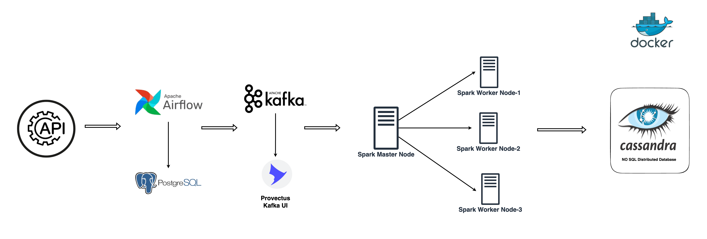

# Real-Time Production-Grade Data Pipeline

## Overview
This project demonstrates a real-time, production-grade data pipeline using modern data engineering tools. The pipeline is designed to process streaming user profile data end-to-end, from ingestion to storage, with orchestration and distributed processing.

## Architecture
**Components:**
- **Kafka**: Real-time data ingestion (user profile stream)
- **Spark**: Distributed stream processing
- **Airflow**: Workflow orchestration and scheduling
- **Cassandra**: Scalable NoSQL data storage
- **Docker Compose**: Container orchestration for easy setup and reproducibility





## Features
- Real-time user profile data ingestion with Kafka
- Distributed stream processing with Spark
- Automated workflow management with Airflow
- Scalable, fault-tolerant data storage with Cassandra
- Fully containerized setup using Docker Compose

## Getting Started

### 1. Clone the Repository
```sh
git clone <your-repo-url>
cd <project-directory>
```

### 2. Start All Services
**Initialize Airflow:**
```sh
docker compose up airflow-init
```
**Start All Services:**
```sh
docker compose up -d
```

### 3. Create Kafka Topic
```sh
docker exec -it broker kafka-topics.sh --create --topic user_profile_stream --bootstrap-server localhost:9092 --partitions 1 --replication-factor 1
```

### 4. Submit Spark Job
```sh
zip -r dependencies.zip constants spark_streaming

docker cp dependencies.zip spark-master:/dependencies.zip

docker exec -it spark-master pip install cassandra-driver

docker exec -it spark-master spark-submit \
    --packages com.datastax.spark:spark-cassandra-connector_2.12:3.5.1,org.apache.spark:spark-sql-kafka-0-10_2.12:3.5.1 \
    --py-files /dependencies.zip \
    /opt/spark/spark_streaming/spark_processing.py
```

### 5. Verify Data in Cassandra
**Check record count:**
```sh
docker exec -it cassandra cqlsh -e "SELECT COUNT(*) FROM spark_streaming.created_users;"
```
**View sample data:**
```sh
docker exec -it cassandra cqlsh -e "SELECT * FROM spark_streaming.created_users LIMIT 5;"
```

## Project Structure
```
├── dags/                # Airflow DAGs
├── spark_streaming/     # Spark streaming jobs
├── constants/           # Shared constants/configs
├── pipelines/           # (optional) ETL pipelines
├── docker-compose.yml   # Main orchestration file
├── requirements.txt     # Python dependencies
└── ...
```

## Use Case Example
- **Scenario:** Ingest user profile data in real time (e.g., user signups, updates)
- **Flow:**
    1. Producer sends user profile events to Kafka topic `user_profile_stream`
    2. Spark streaming job consumes from Kafka, processes/transforms data
    3. Processed data is written to Cassandra for fast, scalable storage
    4. Airflow orchestrates/schedules batch or streaming jobs as needed

## Prerequisites
- Docker & Docker Compose installed
- Basic familiarity with Python and distributed systems

## Notes
- This project is designed for learning and demonstration. For production, consider adding monitoring, alerting, and security best practices.

---

**Feel free to use, extend, or adapt this project for your own learning or interviews!**
